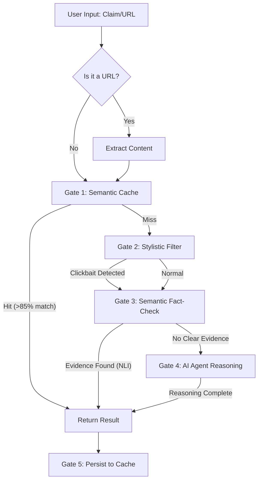

# 🧠 How the System Works: 5-Gate Waterfall Architecture

This document provides a deep dive into the internal logic and workflow of the **Fake News Detection System**. The system is designed as a "Waterfall," meaning it attempts the fastest and cheapest verification methods first before escalating to more complex and expensive AI reasoning.

---

## 🌊 The Workflow Overview

When a user submits a claim or a URL, the system follows this sequential path:

---

## 🛡️ Gate 1: Semantic Cache (Vector DB)
*   **Purpose:** Instant results for previously verified claims.
*   **Technology:** ChromaDB (Vector Database) + `paraphrase-multilingual-MiniLM-L12-v2` (Embeddings).
*   **Logic:** 
    1.  The system converts the input text into a high-dimensional vector (embedding).
    2.  It searches ChromaDB for vectors with a distance of less than **0.15** (meaning >85% semantic similarity).
    3.  If a match is found, it returns the stored verdict immediately, bypassing all AI/Search steps.

## 🎭 Gate 2: Stylistic Filter (Local NLP)
*   **Purpose:** Detect linguistic patterns typical of fake news (sensationalism, bias, clickbait).
*   **Technology:** Local **PhoBERT** (Vietnamese-specialized BERT model).
*   **Logic:**
    1.  The text is analyzed for emotional intensity and "clickbait" keywords (e.g., "Sốc", "Kinh hoàng", "100% tin chuẩn").
    2.  PhoBERT predicts the probability of the text being "stylistically unreliable."
    3.  This gate provides a "Signal" but usually doesn't exit the flow unless the probability is extremely high (>98%).

## 🔍 Gate 3: Semantic Fact-Check (NLI)
*   **Purpose:** Verify facts using live data without using expensive LLM reasoning.
*   **Technology:** DuckDuckGo Search + Wikipedia API + **XLM-Roberta Cross-Encoder (NLI)**.
*   **Logic:**
    1.  The system extracts keywords and searches the web/Wikipedia for live context.
    2.  It takes the top snippets and uses a **Natural Language Inference (NLI)** model to compare the claim against the snippet.
    3.  **Labels:**
        *   `Entailment`: The source supports the claim (**True**).
        *   `Contradiction`: The source disproves the claim (**Fake**).
        *   `Neutral`: No clear relationship.
    4.  If Entailment > 0.90 or Contradiction > 0.95, the system exits with a verdict and the exact source snippet.

## 🤖 Gate 4: Agentic Reasoning (Gemini AI)
*   **Purpose:** The "Final Boss." Handles complex claims requiring multi-step thinking or numerical analysis.
*   **Technology:** **LangChain ReAct Agent** + **Gemini 2.0 Flash**.
*   **Logic:**
    1.  If Gates 1-3 fail to find a definitive answer, the AI Agent takes over.
    2.  The Agent uses the **ReAct** pattern:
        *   **Thought:** "I need to find the population of Hanoi in 2024 to verify this."
        *   **Action:** Search DuckDuckGo for "Hanoi population 2024."
        *   **Observation:** Found a government report stating 8.5 million.
    3.  It can iterate multiple times, using tools (Search, Wiki, Scraper) until it is confident.
    4.  It produces a detailed Vietnamese explanation with citations.

## 💾 Gate 5: Knowledge Base Update
*   **Purpose:** System "learning" and self-improvement.
*   **Technology:** Prisma + SQLite + ChromaDB.
*   **Logic:**
    1.  Once a final verdict is reached (from Gate 3 or 4), the result is saved to the SQLite database.
    2.  The claim is embedded and added to the ChromaDB Vector Index.
    3.  Next time someone asks the same (or a similar) question, **Gate 1** will catch it, making the system faster and cheaper over time.

---

## 🛠️ Summary of Key Thresholds

| Parameter | Value | Description |
| :--- | :--- | :--- |
| Semantic Distance | 0.15 | Max distance for a Cache Hit (>85% similarity). |
| NLI Entailment | 0.90 | Confidence required to mark as "True" in Gate 3. |
| NLI Contradiction | 0.95 | Confidence required to mark as "Fake" in Gate 3. |
| Early Exit Prob | 0.98 | PhoBERT probability to stop early at Gate 2. |

---

## 🚀 Why this architecture?
1.  **Cost Efficiency:** Saves 90%+ on API costs by using local models and caching.
2.  **Speed:** Cache hits return in milliseconds.
3.  **Transparency:** Unlike "black-box" AI, Gate 3 and 4 provide direct quotes and URLs as proof.
4.  **Local Expertise:** Uses PhoBERT to ensure the nuances of the Vietnamese language are respected.
